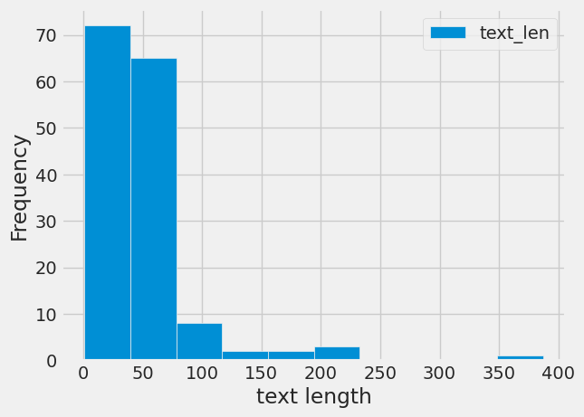

## SENTINEL - Social Entity and Tweet Information for Natural Language-based Emergency Labeling

SENTINEL is a Python-based Natural Language Processing (NLP) project designed for text classification of tweets. It focuses on classifying tweets into categories such as toxicity (default) with the aim of identifying content related to disasters.

## Overview

- **Python:** The project is implemented in Python, leveraging its powerful capabilities for NLP tasks.
- **Natural Language Processing:** SENTINEL uses NLP techniques to analyze and classify tweets based on their content.
- **Text Classification:** The main goal of the project is to classify tweets into predefined categories, with a default focus on toxicity.

## Project Structure

- `sentinel.ipynb`: The main notebook containing the NLP and text classification functionality.
- `data/`: Directory containing sample datasets for training and testing.
- `results/`: Folder for storing the output and results of the classification.
- `graphs/`: Folder for saving visualizations, such as the frequency and text length graph.

## Installation

1. Clone the repository:

```bash
git clone https://github.com/pranjal2411/sentinel.git
```

2. Install the required dependencies:

```bash
pip install -r requirements.txt
```

## Usage

1. Navigate to the project directory:

```bash
cd sentinel
```

2. Run the main script:

```bash
sentinel.ipynb
```

3. Follow the on-screen instructions for input and analysis.

## Visualization



The above graph illustrates the frequency and text length of tweets processed by SENTINEL.

## Contributing

Contributions are welcome! Feel free to open issues or submit pull requests.

## License

This project is licensed under the MIT License - see the [LICENSE](LICENSE) file for details.
